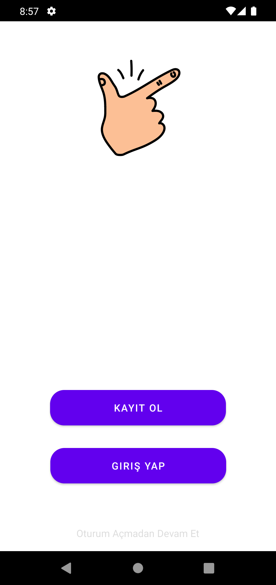
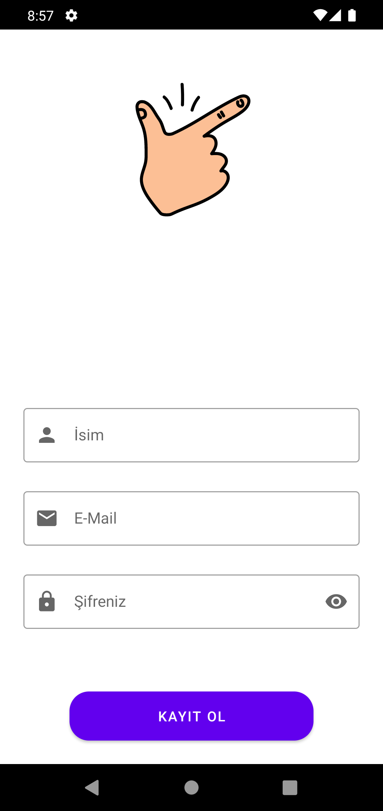
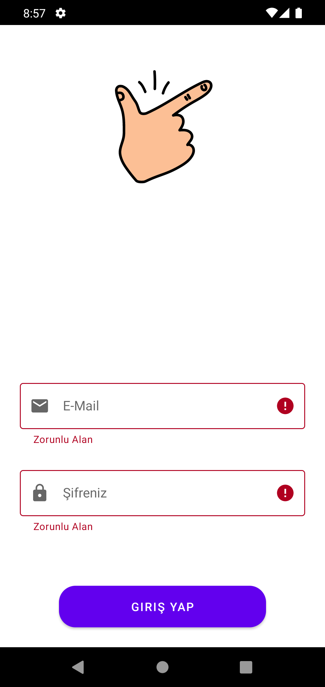
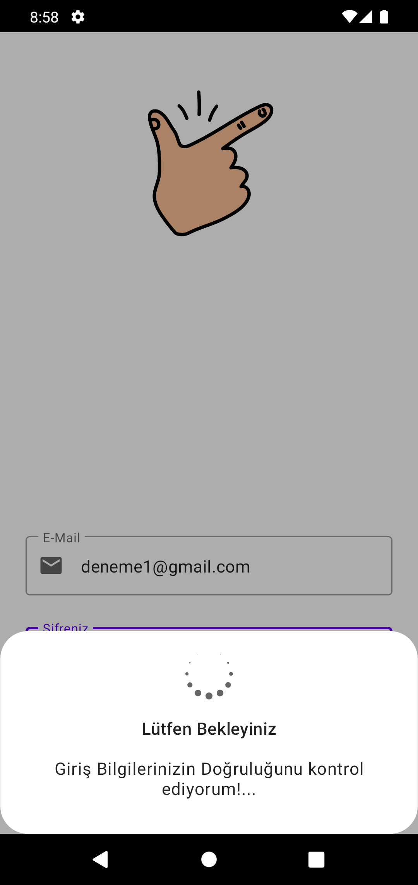
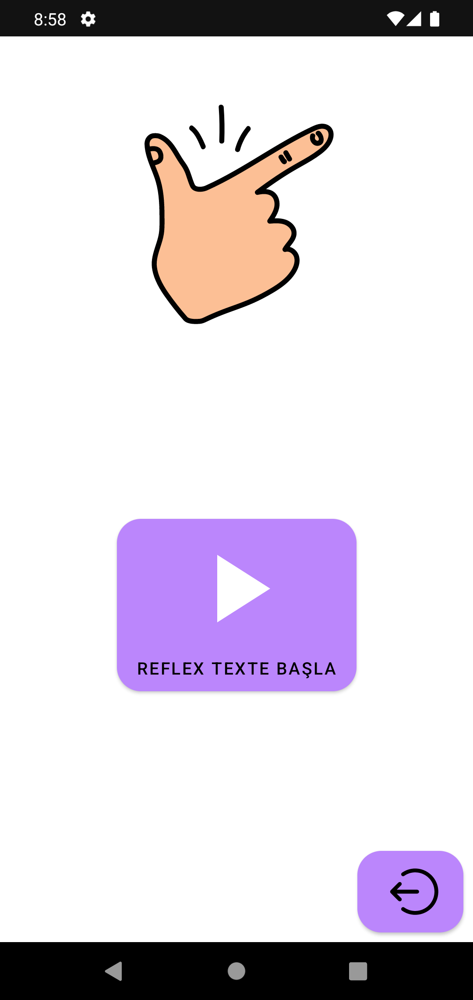
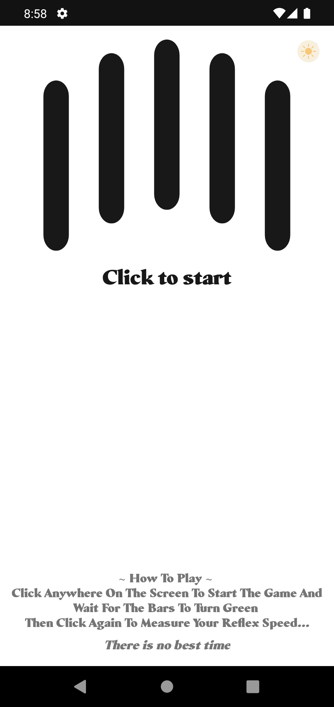
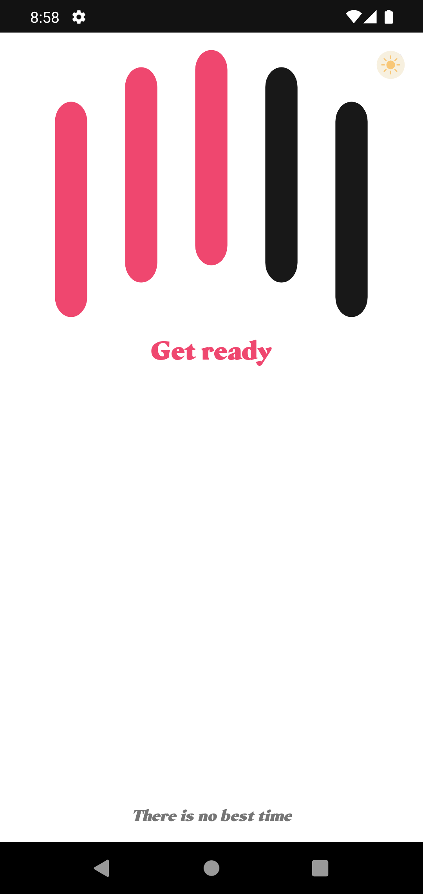
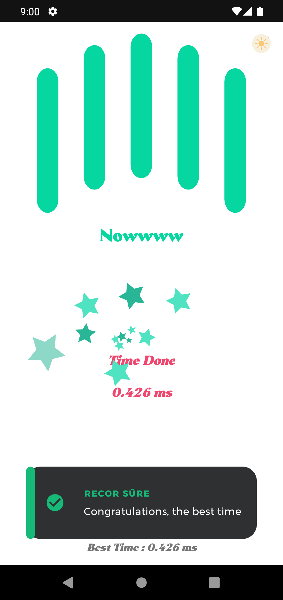
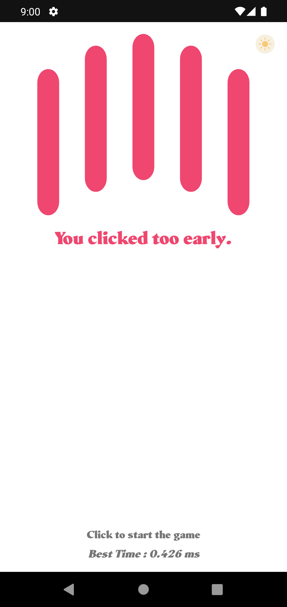

# BakalimNeKadarHizlisin
Android programlama ile ilk tanıştığım zamanlar yazılım öğrenmek için yapmış olduğum birkaç uygulamadan biri.

Malesef 2020 yıllı civarı yapmaya uğraştığım bu uygulamaları GitHub üzerinden ilerletmediğim ve kaynak dosyalarının bulunmamasından dolayı şuan elimde sadece APK dosyası bulunmakta.

# Ekran Görüntüleri

  
  
  

  
  
  

  
  
  
  

